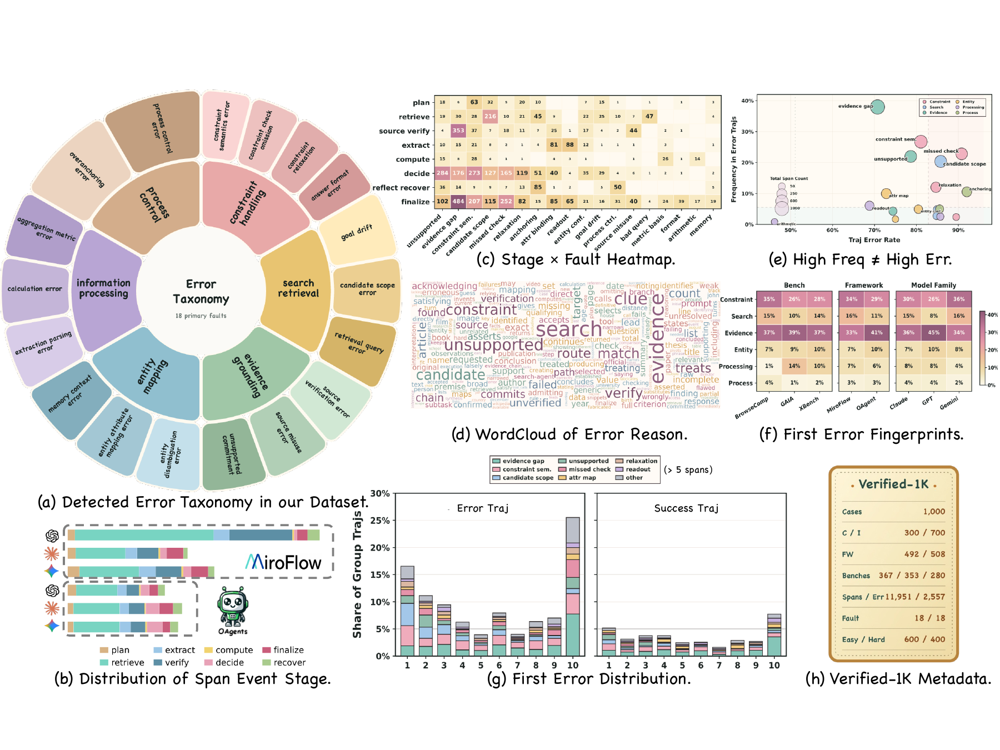
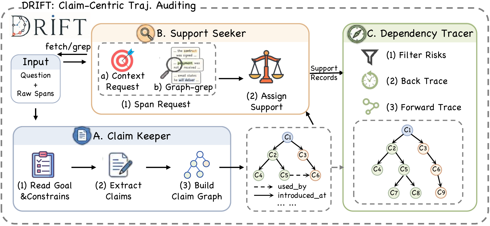

# DRIFT

> **Where Do Deep-Research Agents Go Wrong? Span-Level Error Localization in Agent Trajectories**

**NJU-LINK Team, Nanjing University · JIUTIAN Research**

<p align="center">
  <a href="https://arxiv.org/abs/2606.02060"></a>
  <a href="https://nju-link.github.io/DRIFT/"></a>
  <a href="https://huggingface.co/datasets/NJU-LINK/TELBench"></a>
  <a href="https://github.com/NJU-LINK/DRIFT"></a>
  <a href="docs/USAGE.md"></a>
</p>

DRIFT is a claim-centric auditing framework for diagnosing deep-research agent
trajectories. Instead of only checking whether the final answer is correct,
DRIFT localizes the semantic spans where an agent first makes, reuses, or
finalizes harmful unsupported claims.

We release:

- **TELBench**, a 1,000-instance benchmark for span-level error localization in
  real deep-research trajectories.
- **DRIFT**, a clean runner with two comparable settings: `bare` full-context
  prediction and the full claim-centric `drift` pipeline.
- **Project page**, figures, prompts, and reproducibility utilities.

<p align="center">
  
</p>

## What We Study

Deep-research agents solve tasks through long trajectories of search, tool use,
evidence inspection, hypothesis testing, and answer synthesis. Final-answer
accuracy says whether the agent succeeds, but not which step made the trajectory
unreliable. TELBench turns this into a process-level task: given only the
question and ordered raw semantic spans, predict the harmful error span ids.

<p align="center">
  
</p>

## DRIFT in Brief

DRIFT audits trajectories as claim graphs rather than independent spans:

1. **Claim Keeper** records decision-critical claims and when they become
   consequential.
2. **Support Seeker** uses graph-grep raw-span access to check whether those
   claims are supported by trajectory evidence.
3. **Dependency Tracer** localizes spans where unsupported claims become harmful
   commitments.

Model prompts receive only the task question and ordered raw span text. Gold
labels, annotations, judge results, span types, manual notes, and generated
summaries are stripped before prompting.

## Quick Start

```bash
git clone https://github.com/NJU-LINK/DRIFT.git
cd DRIFT
python -m pip install -e .
python -m pip install -U huggingface_hub

hf download NJU-LINK/TELBench \
  --repo-type dataset \
  --local-dir data \
  --include "TELBench.jsonl.enc" \
  --include "TELBench.jsonl.enc.sha256" \
  --include "TELBench.jsonl.sha256" \
  --include "TELBench.passphrase.txt"

bash scripts/decrypt_telbench.sh

cat > .env <<'EOF'
API_URL=https://example.com/codex
API_KEY=your_api_key_here
EOF

drift \
  --setting drift \
  --input data/TELBench.jsonl \
  --model gpt-5.4 \
  --api-type responses \
  --env-file .env \
  --outdir runs/telbench_gpt54 \
  --workers 8

drift-eval \
  --gold data/TELBench.jsonl \
  --pred runs/telbench_gpt54/drift/gpt-5.4/summary.json \
  --output runs/telbench_gpt54/drift/gpt-5.4/eval.json
```

For complete API, data, and evaluation details, see [docs/USAGE.md](docs/USAGE.md).
For the TELBench JSONL schema, see [data/README.md](data/README.md).

## Project Structure

```text
DRIFT/
├── data/
│   └── README.md              # download TELBench artifacts from Hugging Face
├── docs/
│   ├── index.html
│   ├── styles.css
│   ├── USAGE.md
│   └── assets/
├── scripts/
│   └── decrypt_telbench.sh
├── src/drift_open/
│   ├── cli.py
│   ├── client.py
│   ├── data.py
│   ├── evaluate.py
│   ├── prompts.py
│   ├── runner.py
│   └── span_store.py
├── tests/
└── pyproject.toml
```

## Links

- Project page: [https://nju-link.github.io/DRIFT/](https://nju-link.github.io/DRIFT/)
- Usage guide: [docs/USAGE.md](docs/USAGE.md)
- Data guide: [data/README.md](data/README.md)
- Code package: [src/drift_open](src/drift_open)

## Citation

```bibtex
@misc{wang2026drift,
  title  = {Where Do Deep-Research Agents Go Wrong? Span-Level Error Localization in Agent Trajectories},
  author = {Wang, Jiaming and Feng, Ziteng and Wu, Jiangtao and others},
  year   = {2026},
  note   = {DRIFT project}
}
```
